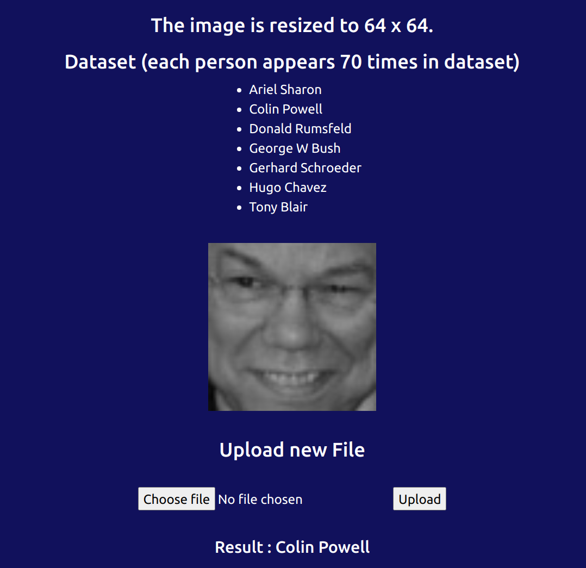
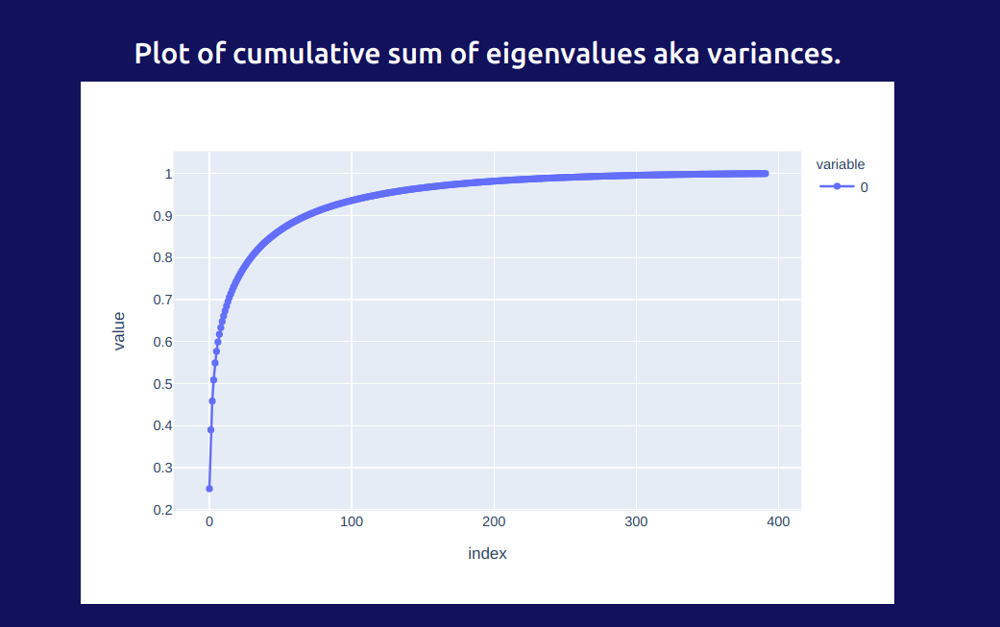

# Eigenfaces for Face Recognition

## Abstract

Face recognition is used everywhere, now a days deep learning techniques are also used; although techniques like PCA (Principal Component Analysis) can be used for storing faces that make up the faces in dataset ("eigenfaces") i.e. principal components.

## Algorithm

### Training

1. Stack flattened images on top of each other as dataset matrix (**X**, size is `4096 x no of training images`).

2. Calculate the mean image.

3. Center the dataset by subtracting the mean image from each.

4. Calculate the convariance matrix `Xt*X / n-1` where n is number of training images.

5. Calculate the eigevectors, eigenvalues of this covariance.

6. Sort the eigenvalues and the eigenvectors in place. Use the top **K** eigenvectors where K < n.

7. Do X * eigenvectors to get K eigenvectors of X*Xt and normalize the eigenvectors to get unit vectors.

8. Now you can get the coefficients of linear combinations of eigenfaces now, store the coefficients.

### Testing

1. In a similiar manner; flatten, center (by training mean) a test image and get coefficient vector by multiplying with eigenvectors.

2. Check which coefficient vector in train images is the test image's is closer to.

3. Get the label of that image, you have now classified !

4. Profit? :rocket:

## Installation

1. Download image dataset (grayscale version) given at https://conradsanderson.id.au/lfwcrop/ and extract it. The dataset contains 64x64 images.

2. Install required python modules.

    ```
    plotly >= 5.2.1
    numpy
    opencv-python
    sklearn
    flask
    ```

3. Run the eigenfaces.py and app.py.

4. Open the app, upload the image and get classification. By default top 150 eigenvectors are used.

## Preprocessing

All the faces should be having same size, in grayscale format.
Subject should be in the center; less background in the image, the better.

## Working

I have saved model in `npy` binary files.

Also the dataset has every person having 70 images atleast.
This can be changed accordingly to reduce computational power.

App uses Flask as web server; opencv, numpy for computations; plotly as plotting library.





## Improvements

1. Plot the eigenfaces.

2. Learn streamlit and adapt it here.

3. Change K from page for eigenvectors.

4. Decrease minimum frequency from 70 to 40 (make it dynamic :p)

## References

1. Matthew Turk and Alex Pentland. 1991. Eigenfaces for recognition. J. Cognitive Neuroscience 3, 1 (Winter 1991), 71–86. DOI:https://doi.org/10.1162/jocn.1991.3.1.71

2. https://www.geeksforgeeks.org/ml-face-recognition-using-eigenfaces-pca-algorithm/
